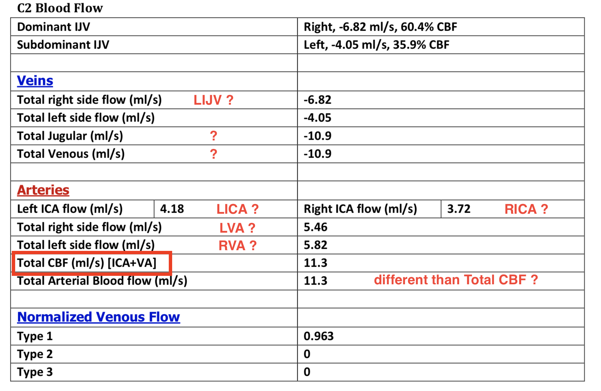

## Notes for Haacke Group
Prepared by Sean Ma @MADC
Mar 30, 2018

### Conference call notes
1. 4/12/2018, 4:28:15 PM
    - Sean will include the 4 missing folders
    - within the 4 missing folders, the `SPINGenerated` includes the Excel sheets. These files instead will be uploaded to our shared **Box** folder
    - they will add the MTL in the report
    - group reports will be done by n=50 as it requires extra time to compile. If individual Excel sheets have the needed volume/pixel/etc, then I can compile it myself instead.
    -  Sean requested to share the diagnosis for these SWI subjects ==> Ask Ari

### Questions regarding reports

#### General questions
1. For the `Processed` subject folders (see snapshot below),
    - what are the folders with prefix `A1/A2/A3` for? and how can they be used in our analysis stream?
    - there are some folders with the `Registration` folder. Are these dicom registered to **MNI space**?
    - snapshot
        

2. How will **individual** report and **group** report be delivered? Currently, only the **1st batch** has _individual_ report and the **1st & 2nd batch** have _group_ report.

3. There are some missing folders in the `/STAGE` folder when comparing between the _UMH_00000x_preprocessed_ folders on the **sftp server** versus the **1st 10 batch dicoms** which was uploaded to our shared **Box** folder. Specifically the folders below are missing:
    ```shell
    10_simFLAIR
    11_simT2W
    12_MRA_cow
    SPINGenerated
    ```
4. L/R notation inconsistent.

#### Individual subject report
0. For all analysis, are the MRI head images coregistered to MNI space?
    - If yes, can locations of the findings be reported as MNI coordinates with deficit volumes paired?
1. For `white matter hyper intensities` in Section 2. Conventional MRI Sequences,
    - can the coordinates as well as the volumes be provided as well as which image modality it was derived from (ie. FLAIR, T2W, or T1W)?
    - is there a derived overlay file (that can be overlayed to the corresponding image modality dicoms) which labels/annotate the locations of the **white matter hyper-intensities**?
2. For `Cerebral microbleeds` in Section 3. Susceptibility Weighted Imaging Findings,
    - can the coordinates as well as the volumes be provided as well as which image modality it was derived from (ie. SWI Phase, SWI Magnitude, SWI mIPs, SWIM MIP, SWIM Phase)?
    - is there a derived overlay file (that can be overlayed to the corresponding image modality dicoms) which labels/annotate the locations of the **cerebral microbleeds**?
3. For the `Microbleed Anatomical Rating Scales (MARS)` form, in Section 3.6,
    - Is it possible to include the Medial Temporal Lobe (MTL) in this table?
    - can an Excel file be provided to allow easy download and integration into our database?
4. For Section 3.7, `SWIM Quantification of the Deep Gray Matter`,
    - could this section be re-analyzed after the age/gender information is provided (which has been included in our 4th batch package)?
5. For the tables in 3.8, 3.9, 3.10, 3.11,
    - again, is it possible to include the MTL regions in this table?
    - can you define the meaning and units of the variables: `Number`, `Mean` and `Volume`?
    - the `Number` variable seems to share the same values for table 3.8 - `Iron Quantification of the Deep Gray Matter Structures and Dentate Nucleus using R2*` and table 3.9 - `Iron Quantification of the Deep Gray Matter Structures and Dentate Nucleus using SWIM`. Is there a specific reason for this?
    - the `Number` variable seems to share the same values for table 3.10 - `T1 MAP Values for the Deep Gray Matter Structures and Dentate Nucleus using R2*` and table 3.11 - `PD MAP Values for the Deep Gray Matter Structures and Dentate Nucleus using SWIM`. Is there a specific reason for this?
6. For the Section 5. `Compiled Flow Report` section,
    - in the `C2 Blood Flow` table, there is inconsistant use of abbreviated terminology or not in the table
        - such as `Total Jugular (ml/s)` is used as `Total IJV (ml/s)` in the `Flow findings` section in the group findings report (dated 2-28-2018).
        - or no entry and definition for `Total ICA (ml/s)` or `Total VA (ml/s)` but has been listed in the `Flow findings` section in the group findings report.
    - I have included an example snapshot from subject `hlp17ummm01359` for his/her individual report vs. group findings report
    - For the `Average Velocity`, `Integrated Flow`, `Negative Volume Flow Rate`, `Positve Volume Flow Rate`, and `Volume Flow Rate` charts, is it possible to provide an Excel file to allow access to the raw data?
    - snapshot1
        
    - snapshot2
        

### Group Findings Report
1. Can the `CMB Counts and Quantification` table in Page 7 and `FLAIR Table of WMH` in Page 13 be included as well in each subject's individual report? This links back to the the #1, #2 requests in the individual report section for the location/coordinates and volumes of the deficits.
2. Again, can you define the variables for `Pixels`, `Volume`, `Mean` for both tables in `CMB Counts and Quantification` and `FLAIR Table of WMH`?
3. The `Mean` and `Volume` column labels for tables in `CMB Counts and Quantification` section, seems to be mislabeled on Page 7 vs Page 10.
    - snapshot3
        
    - snapshot4
        
