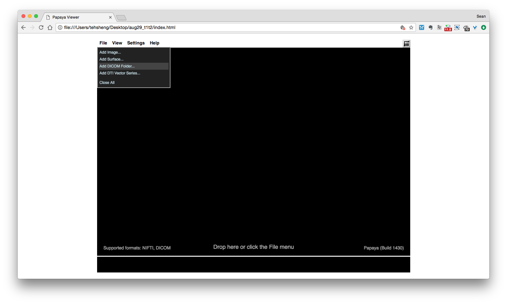
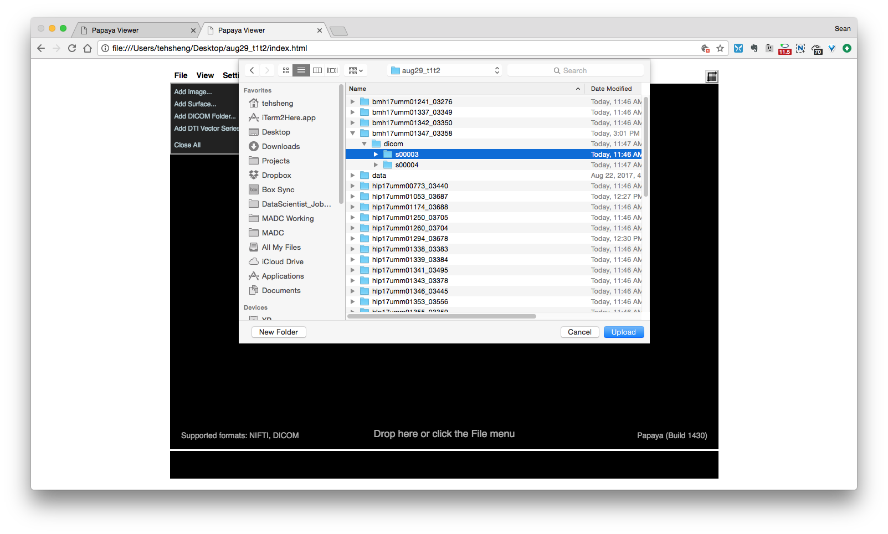
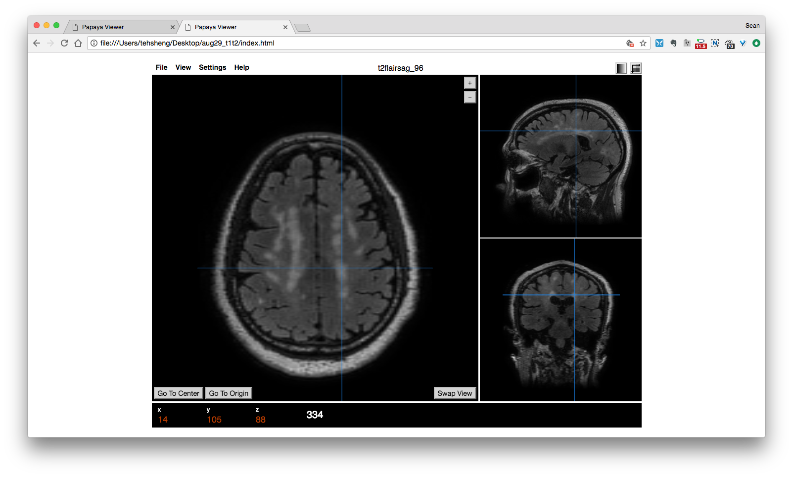

## Papaya web DICOM viewer guide

Author: Sean Ma
Date: 8/31/2017

### 1. Open `index.html`
You should then see a dark panel view with `File` menu on the upper left , similar to the one below:

### 2. Click on `add DICOM folder`
This will allow you to load the different folders associated with different subjects.

### 3. Load the subject DICOM folder
In general, `s0003` folder is the T1-MPRAGE sequence, where as the `s0004` is the T2 FLAIR sequence.

### 4. Multiplanar view
After loading in the DICOM sequence, you should see a 3 panel viewer similar to the one below. You can click the `Switch View` button to swap between the different slice views.

If you need to change the contrast, on the upper right, there is a greyscale icon that allows you to change the contrast.

